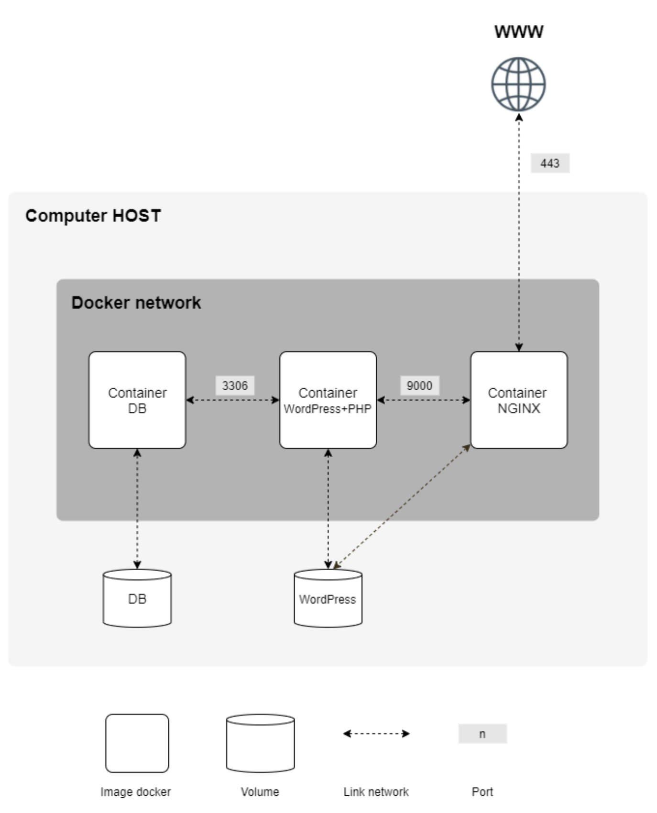
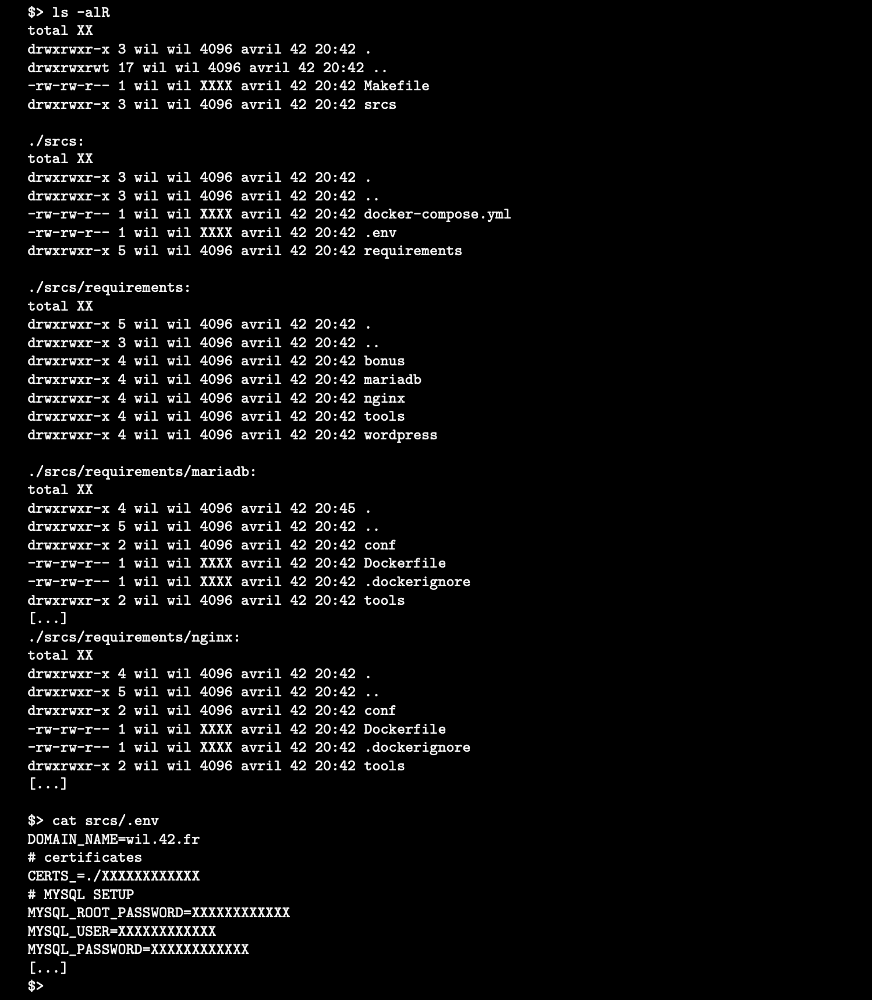

> **Playground Setup:**
> - mode=complete
> - model=text-davinci-003
> - temperature=0.3
> - top_p=1
> - frequency_penalty=0
> - presence_penalty=0
> 

<details>
  <summary>
    <!-- <h1> -->
      Subject
    <!-- </h1> -->
  </summary>

# Subject

### General guidelines


- This project needs to be done on a **Virtual Machine**.
- All the files required for the configuration of your project must be placed in a **srcs** folder.
- A **Makefile** is also required and must be located at the root of your directory. It must set up your entire application (i.e., it has to build the Docker images using docker-compose.yml).
- This subject requires putting into practice concepts that, depending on your background, you may not have learned yet. Therefore, we advise you not to hesitate to read a lot of documentation related to **Docker** usage, as well as anything else you will find helpful in order to complete this assignment.

### Mandatory part


This project consists of having you set up a small infrastructure composed of different services under specific rules. The whole project has to be done in a virtual machine. You have to use `docker compose`.

- Each **Docker image** must have the same name as its corresponding service.
- Each service has to run in a dedicated **container**.
- For performance matters, the containers must be built either from the penultimate stable version of Alpine or **Debian**. The choice is yours.
- You also have to write your own **Dockerfiles**, one per service. The Dockerfiles must be called in your `docker-compose.yml` by your Makefile.
- It means you have to build yourself the Docker images of your project. It is then **forbidden** to pull ready-made Docker images, as well as using services such as DockerHub (Alpine/Debian being excluded from this rule).

 
You then have to set up:

- [ ]  A Docker container that contains **NGINX** with TLSv1.2 or TLSv1.3 only.
- [ ]  A Docker container that contains **WordPress** + **php-fpm** (it must be installed and configured) only without nginx.
- [ ]  A Docker container that contains **MariaDB** only without nginx.
- [ ]  A volume that contains your WordPress **database**.
- [ ]  A second volume that contains your WordPress **website files**.
- [ ]  A **docker network** that establishes the connection between your containers.

Your containers have to restart in case of a crash.

> A Docker container is not a virtual machine. Thus, it is not recommended to use any hacky patch based on ’`tail -f`’ and so forth when trying to run it. Read about how **daemons** work and whether it’s a good idea to use them or not.
> 
> 


> Of course, using network: `host` or `--link` or `links`: is forbidden. The network line must be present in your docker-compose.yml file. Your containers must not be started with a command running an infinite loop. Thus, this also applies to any command used as entrypoint, or used in entrypoint scripts. The following are a few prohibited hacky patches: `tail -f`, `bash`, `sleep infinity`, `while true`.
> 

> Read about `PID 1` and the best practices for writing Dockerfiles.
> 
- [ ]  In your WordPress database, there must be two users, one of them being the administrator. The administrator’s username can’t contain admin/Admin or administrator/Administrator (e.g., admin, administrator, Administrator, admin-123, and so forth).

> Your volumes will be available in the /home/login/data folder of the host machine using Docker. Of course, you have to replace the login with yours.
> 

To make things simpler, you have to configure your domain name so it points to your local IP address.

This domain name must be [`login.42.fr`](http://login.42.fr/). Again, you have to use your own login.
For example, [`lfiorini.42.fr`](http://wil.42.fr/) would redirect to the IP address pointing to my website.

> The latest tag is prohibited.
> 
> No password must be present in your Dockerfiles.
> 
> It is mandatory to use environment variables.
> 
> Also, it is strongly recommended to use a `.env` file to store environment variables. The `.env` file should be located at the root of the **srcs** directory.
> 
> Your NGINX container must be the only entrypoint into your infrastructure via the **port 443** only, using the TLSv1.2 or TLSv1.3 protocol.
> 


### Diagram

Diagram of the expected result




### Directory Structure

Example of the expected directory structure




> For obvious security reasons, any credentials, API keys, env variables etc... must be saved locally in a `.env` file and ignored by git. Publicly stored credentials will lead you directly to a failure of the project.
> 

## Bonus part

For this project, the bonus part is aimed to be simple.

A Dockerfile must be written for each extra service. Thus, each one of them will run inside its own container and will have, if necessary, its dedicated volume.

Bonus list:

- [ ]  Set up `redis cache` for your WordPress website in order to properly manage the cache.
- [ ]  Set up a `FTP server` container pointing to the volume of your WordPress website.
- [ ]  Create a simple static website in the language of your choice except PHP (Yes, PHP is excluded!). For example, a showcase site or a site for presenting your resume.
- [ ]  Set up Adminer.
- [ ]  Set up a service of your choice that you think is useful. During the defense, you will have to justify your choice.

> To complete the bonus part, you have the possibility to set up extra services. In this case, you may open more ports to suit your needs.
> 

> The bonus part will only be assessed if the mandatory part is PERFECT. Perfect means the mandatory part has been integrally done and works without malfunctioning.
If you have not passed ALL the mandatory requirements, your bonus part will not be evaluated at all.
> 

</details>

# Summary

## Mandatory Requirements

### **Docker Containers:**
1. **NGINX (with TLSv1.2 or TLSv1.3):**
     - Create a Dockerfile for NGINX.
     - Configure NGINX to use only TLSv1.2 or TLSv1.3.
     - Ensure the container restarts in case of a crash.
   
2. **WordPress + php-fpm (without nginx):**
     - Create a Dockerfile for WordPress with php-fpm.
     - Configure and install php-fpm within the container.
     - Ensure the container restarts in case of a crash.
   
3. **MariaDB (without nginx):**
     - Create a Dockerfile for MariaDB.
     - Ensure the container restarts in case of a crash.
   
### **Volumes:**
1. **WordPress database**
   - Configure to be accessible on the host at `/home/lfiorini/data`.
   - Create two users, one being an administrator.
     - The administrator’s username can’t contain admin/Admin or administrator/Administrator (e.g., admin, administrator, Administrator, admin-123, and so forth).
2. **WordPress website files**
   - Configure to be accessible on the host at `/home/lfiorini/data`.

### **Network:**
- Create a Docker network to establish the connection between the containers.

### **Domain:**
- Configure the domain name `lfiorini.42.fr` to point to the local IP address.

### **Makefile:**
- Create a Makefile to set up the entire application (i.e., build the Docker images using docker-compose.yml).

## Bonus Requirements

1. **Redis Cache:**
   - Create a Dockerfile for Redis Cache.
   - Configure Redis Cache for the WordPress website.

2. **FTP Server:**
   - Create a Dockerfile for the FTP server.
   - Configure the FTP server to point to the WordPress website volume.

3. **Static Website:**
   - Create a static website in a language of your choice (except PHP).

4. **Adminer:**
   - Set up Adminer.

5. **Service of Your Choice:**
   - Set up a service of your choice that you think is useful.
   - Justify your choice during the defense.

## Directory Structure

```
C:\Users\lfiorini

├── Makefile
├── srcs
│   ├── docker-compose.yml
│   ├── .env
│   └── requirements
│       ├── bonus
│       ├── mariadb
│       │   ├── conf
│       │   │   └── mariadb.conf
│       │   ├── Dockerfile
│       │   ├── .dockerignore
│       │   └── tools
│       │       └── Makefile
│       ├── nginx
│       │   ├── conf
│       │   │   └── nginx.conf
│       │   ├── Dockerfile
│       │   ├── .dockerignore
│       │   └── tools
│       │       └── Makefile
│       └── wordpress
│           └── requirements
│               └── mariadb
│                   ├── Dockerfile
│                   ├── .dockerignore
│                   └── tools
│                       └── Makefile
└── .dockerignore
```

# Solution

## Makefile

The Makefile should be used to build the Docker images using docker-compose.yml.

```makefile
#!/usr/bin/env make

all:
	docker-compose up -d

build:
	docker-compose build

stop:
	docker-compose down

clean:
	docker-compose down --rmi all

```

## docker-compose.yml

The docker-compose.yml should be used to define the services and their configuration.

```yaml
version: '3.7'

services:
  nginx:
    build:
      context: ./srcs/requirements/nginx
    ports:
      - 443:443
    environment:
      - DOMAIN=${DOMAIN}
    restart: always
    networks:
      - web

  wordpress:
    build:
      context: ./srcs/requirements/wordpress
    environment:
      - DB_HOST=mariadb
      - DB_USER=${DB_USER}
      - DB_PASSWORD=${DB_PASSWORD}
      - DB_NAME=${DB_NAME}
    volumes:
      - wordpress_data:/var/www/html
    restart: always
    networks:
      - web

  mariadb:
    build:
      context: ./srcs/requirements/mariadb
    environment:
      - MYSQL_ROOT_PASSWORD=${MYSQL_ROOT_PASSWORD}
      - MYSQL_USER=${MYSQL_USER}
      - MYSQL_PASSWORD=${MYSQL_PASSWORD}
      - MYSQL_DATABASE=${MYSQL_DATABASE}
    volumes:
      - mariadb_data:/var/lib/mysql
    restart: always
    networks:
      - web

volumes:
  wordpress_data:
  mariadb_data:

networks:
  web:

```

## .env

The .env should be used to store environment variables.

```
DOMAIN=lfiorini.42.fr
DB_USER=wordpress
DB_PASSWORD=password
DB_NAME=wordpress
MYSQL_ROOT_PASSWORD=password
MYSQL_USER=wordpress
MYSQL_PASSWORD=password
MYSQL_DATABASE=wordpress
```